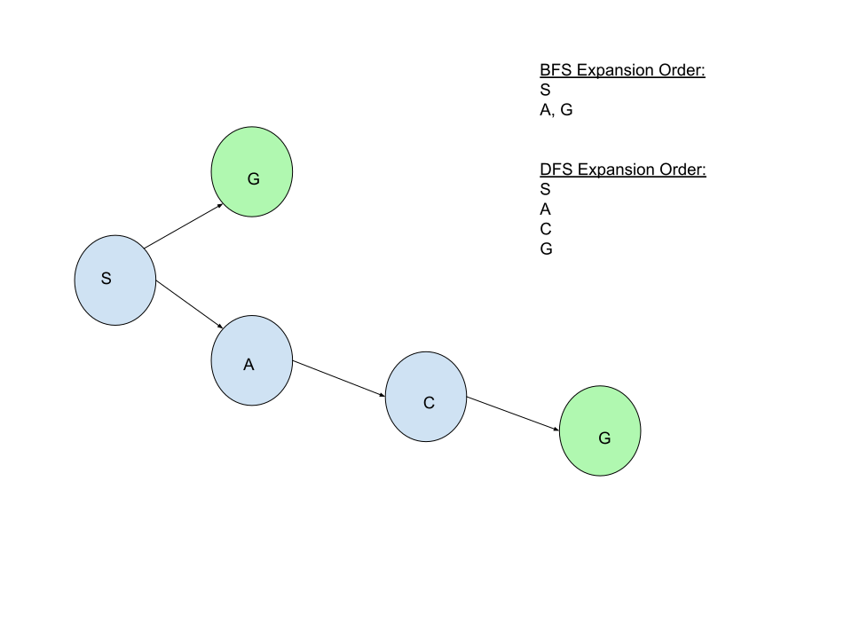

# Programming Assignment 1 COSC76 (21F), 2021, Kunal Jha

## Description

### Setup

The states were represented as a pair (x, y, z), in which x represented the total number of chickens on the left side of the river, y represented the total number of foxes on the left side of the river, and z was an integer that equaled 1 if a boat was on the left side of the river and 0 otherwise. This allowed us to simplify the information needed for computation because we were able to calculate the total amount of chickens and foxes on the right side of the river by doing

*(# chickens on left initially, # foxes on the left initially) - (x, y)*

One states were represented, I generated all possible actions that could occur and stored them within a set, regardless of whether or not the state was valid or not. This could be done to save computation later on due to the fact that the total chickens and foxes on either side could vary by at most 2 (the maximum capacity of the boat) between any consecutive states.

An upper-bound on the number of states regardless of validity is 18. Finding this number was doing simple combinatorics, with the specific calculation being:

*3 (options for the number of chickens on the left) X 3 (options for the number of foxes on the left) X 2 (options for the boat being on the left)*

#### Determining Action Validity

Action validity could be determined off of a few simple rules extrapolated from the problem description. I broke down the rules to two scenarios: whether the boat was moving left or right along the river. For both situations, the main conditions which needed to be checked were whether the boat was initially on the correct side (i.e. on the right side initially if moving right to left), the boat held between 1 to 2 people at all times, and no one was moving to the same side as their river bank (i.e. moving right when initially right). Once all of these conditions were met, I checked the validity of the action by imagining what the next state would be had the action taken place. If the result of the action saw more foxes than chickens on any side, as long as at least one of each species was on that side, this was an invalid action. If all of these conditions were met, the action was a valid action that could be taken.

For simplicity, the figure only shows possible actions given the side the boat is on (you can't have people move left to right if their boat is on the right, so all states that depict such an action are inherently invalid). By showing actions that can occur with a boat on a certain side, there are interesting features to notice. For one, the program can continuously loop between a start state to its successor states and back if path-checking or memoizing is not implemented. This will result in an infinite loop for which a solution will not be found. Another feature of the diagram shows how the constraints on valid actions limits the number of possible next states. Even though certain actions such as moving to a side of the river with more foxes than chickens are possible, these actions terminate the program because the chickens would get eaten, causing no subsequent actions to take place (indicated by red node). As such, if our program learns to avoid these negative actions then their choice of potentially successful actions gets limited to a select few (blue nodes).

### Algorithms

For this assignment the algorithms which were implemented were BFS, recursive, path-checking DFS, and IDS. All three algorithms relied on a **SearchNode** class, which stored information about the current state and the parent node. The specific data structures implemented for each algorithm will be highlighted below.

#### BFS

The BFS algorithm began by initializing an empty frontier and visited set. The frontier was represented as a **deque** object because the algorithm relies on quick append and pop functions. Deque has O(1) time complexity to append and pop from both sides of the list in Python, which allows us to access all of the nodes at the same depth quickly through the *popleft()* function. The *visited* set was represented as a **set** object because for marking whether or not a state was visited, the order it was visited in is irrelevant. Since we only use the visited set to check if states have been explored (this operation takes on average O(1) time and worst case O(n) time in Python) and add unexplored states to the set (this operation takes O(1) time in Python) , sets allow us to efficiently mark and manage visited states.

A solution was initialized as well. This solution made use of the *SearchSolution* class, which was provided to us. The solution would be used to store the path to the goal and the number of nodes visited.

In terms of the actual implementation algorithm, the start state was packed into a node and added to the frontier. From there, a *while* loop executed which continued until the frontier was empty. It began by removing the item from the left of the queue, since this represented all of the nodes on the same level of our figurative search tree (our search problem can be represented as a figurative search-tree where each level of the tree represents all possible successors of the states currently being explored). After being removed from the queue, we checked whether the state had been visited by using the aforementioned *visited* set. If the node had not been visited, it was added to the visited set and the number of nodes visited was increased by 1. From there, the *goalTest* method of the *search_problem* object was used to check where the state currently being explored was the target state. If it was, then the result's path was set to be equal to the backchaining algorithm (who's details will be mentioned below) and the final result was returned. If the state was not equal to the goal state, then the node was expanded using the *getSuccessors* method and the child node's were added to the frontier. This process repeated until either a goal state was found or the frontier was empty, in which case the final solution was returned with an empty path and however many nodes were visited to determine a solution didn't exist.

#### Backchaining

The backchaining algorithm implemented the **deque** class for the same reasons as mentioned in the BFS description. It took a search node as a parameter. It began by adding the node's state to the left of the list to preserve the order of going from *beginning of path* to *end of path*. It then set the current node equal to its parent, and repeated the process until the its parent was equal to *None*. When the parent was equal to *None*, the final deque object was returned.

#### Recursive, Path-checking DFS

I began the RPC-DFS algorithm by making a nested function called DFS. The DFS function took in all of the same parameters as the RPC-DFS algorithm. Its base case relied on the *goalTest* method similar to BFS. If the current node's state was equal to the goal, the backchaining process was executed and an updated solution/solution path was returned. If the current state wasn't the goal state, then the function checked whether the depth limit was 0, in which case an empty solution would be returned. This case was added because each time the function was recursively called, it decremented the depth limit (taken in as a parameter) until it was 0 (this prevents the program from running indefinitely). The recursive case was similar to the BFS algorithm with minor adjustments. All of the child nodes of the current node were iterated over using the *getSuccessors* method and a *for* loop. If they were not in the local solution path (which was a parameter of the function), the number of nodes visited for the local solution was increased by one. Then a copy of the local solution was created so that the memory usage when performing recursion across all children was limited. The child state was added to this temporary path solution so that it wasn't looped over again. The child state was packed into a node with a back-pointer to the current node. From there, the temporary path was set equal to a recursed version of the DFS function, using the search problem, a decremented node depth, the child node, and the temporary solution as parameters. If the result of this recursion was not equal to None (meaning a solution existed), the temporary solution was returned. Outside of the *for* loop, the function returned **None** to imply a solution was not found.

By updating a copy of the solution with visited nodes instead of the actual solution, you avoid the memory issues that come from memoizing. The temporary path is overwritten by the next child's path if it does not contain the solution, and if a solution doesn't exist at all, the temporary path is deleted. This creates at worst *O(2 * bm)* memory cost, which can be simplified to *O(bm)* cost, thus preserving the memory efficiency of DFS. One may argue that the final backchaining set would increase time complexity or memory complexity, however, the time complexity would become *O(b^m + m)* worst case, which simplifies to *O(b^m)* time complexity. Since we are setting the result of the backchaining method to the temporary path, we can overwrite the existing copy of the list and preserve our *O(bm)* memory cost.

Outside of the nested function, the RPC-DFS algorithms made a call to the nested DFS function. If the result of this call was **None**, the result was a new *SearchSolution* object with *solution.nodes_visited* nodes visited. Otherwise, the result returned the call to the nested DFS function.

##### Discussion of Path-Checking DFS

Question 1: Does DFS save significant memory with respect to breadth first search? The answer is yes. DFS works by expanding the leftmost child node first and working down the tree/graph until a solution is reached. If a solution is not found along this path, it replaces the memory of the path it was just on with the path of expanding the next child node. This results in a worst-case space complexity of *O(bm)*, where b is the branching factor and m is the longest path in the tree/graph. In contrast, BFS needs to store memory about each child, as it expands them all simultaneously along the same depth. This can be taxing on memory, and BFS has a memory of *O(min(n, b^d))*, where d is the depth of the shallowest solution. However, DFS can spend more time finding a solution than BFS since it checks the leftmost child first. This can cause it to take too many steps searching at lower depths even though the solution may have been higher up the tree.

In the figure below, DFS spends more time looking for the solution because it expands nodes in the order *S,A,C,G*. This means it has to expand 4 node. In contrast, BFS finds the solution at depth of 1, and only has to expand 2 nodes in the order *S,G*.

Question 2: DFS with memoizing is expensive compared to BFS. This is because the space complexity of DFS with memoizing is *O(min(n, b^m))* and the space complexity of BFS is *O(min(n, b^d))*. Since m (the depth of the maximum path in the state space) is inherently greater than or equal to d (the length of the shallowest path in the graph), memoizing DFS's space complexity will always be greater than or equal to that of BFS until it explores all nodes.

#### Iterative Deepening Search

Implementing this search algorithm required a combination of BFS and DFS. The algorithm worked by running Path-checking DFS at depth 0, and checking if the result contained a solution. If a solution was present, the program was terminated and the solution was returned. Otherwise, the depth was incremented by 1 and the program looped until either a solution was found or the current depth was the same as a user specified depth limit.

I would rather use DFS with path checking than memoizing for iterative deepening search. This is because memoizing would lead to a space complexity for IDS of *O(min(n, b^d))*, which is the same as the space complexity of BFS. Since the time complexity of IDS is already designed to be the same/similar to BFS, if the space complexity is the same as well there would be no advantage of using IDS compared to BFS, and you would just use BFS instead. Since the main advantage of IDS is that it uses the low time complexity of BFS and the low space complexity of DFS, when choosing between path-checking and memoizing approaches to DFS you should choose the one with the smallest space cost. In this case, it is DFS.

## Evaluation

The algorithms implemented performed correctly. BFS found the shortest path length consistently even though it explored more nodes than DFS, which was to be expected. Despite exploring more nodes than DFS, BFS explored these nodes simultaneously and stopped if it found a solution, which means its code was executed quicker than DFS. DFS found a path if one existed, and often explored less nodes than BFS since it was looking for the leftmost solution rather than the optimal one. IDS explored significantly more nodes than either DFS or BFS, and this behavior was expected since every time the depth was increased, the new number of nodes visited was added to the previous number of nodes visited. However, we can verify that IDS performed correctly because it returned the same path as DFS. Even though it explored more nodes than DFS or BFS, its memory usage was the same as DFS since it overwrote its previous memory with that of the local path. Its time complexity was the same as BFS since it stopped if it found a solution in the shallowest depth.

We can further confirm the success of all 3 algorithms because during the example problem (5,5,1), all 3 algorithms stated there was no solution, which means either all or none of them work correctly (I'm inclined to say the former because they display valid paths leading to a solution in the other two test cases).

The comparisons for time and space complexity have been mentioned throughout the report, but for the sake of reiteration they will be listed below.

| Algorithm | Time complexity | Space complexity |
| :---: | :---: | :---: |
| BFS | *O(min(n, b^d))* | *O(min(n, b^d))* |
| DFS | *O(min(m^n, mb^m))* | *O(m)* |
| IDS | *O(min(d^n, db^d))* | *O(d)* |

These time complexities show that BFS typically performs faster than DFS but requires more memory, DFS requires less memory but can be slower, and IDS tries to take the speed advantage of BFS and combine it with the memory advantage of DFS.

### Specific Results from Test Cases

#### Problem 1: 3 Chickens and 3 Foxes

For this problem, BFS returned a path from the start state to the end state of size 11, as did DFS and IDS. However, BFS visited 15 nodes in the process while DFS only visited 11. This indicates that the "leftmost" path of this problem is likely the first one that DFS explored and the algorithm never had to retrace its steps. IDS visited significantly more nodes than either BFS or DFS (66 nodes), but this is because it has to keep revisiting nodes it already explored until it finds the solution or reaches the depth limit. Still, its final path is the same length as DFS.

#### Problem 2: 5 Chickens and 5 Foxes

For this problem, all 3 algorithms were unable to find a solution. BFS and DFS determined there was no successful path after exploring 13 nodes (the maximum number of valid states that weren't the goal state given the problem). IDS once again explored more nodes, this time exploring 1212 nodes. This may seem large but the reason for so many nodes explored is because the depth limit was set to 100. This means that after IDS explored 13 nodes at depth *x* and determined no solution existed, it kept exploring 13 nodes for *(100-x)* times until the program terminated. What might be interesting to see is how you could prevent IDS from continuously exploring the graph even if it determined no solution exists. Since the worst case scenario is that it explores *n* nodes in the graph, where *n* is the number of all possible valid states, I would recommend setting the depth limit to *n* to limit the amount of computations. Due to the implementation of my program, in which I generated possible actions and assessed their validity rather than generated every valid state, this limitation is currently not possible. However, it would be relatively simple to implement (one could simply iterate from 0 to # chickens, 0 to # of foxes, and 0 to # of boats, then see if the generated triple is valid through a *validState* function that had similar constraints to my *validAction* method).

#### Problem 3: 5 Chickens and 4 Foxes

For this problem, BFS found a solution of length 15 after exploring 30 nodes, while DFS and IDS found a solution of length 19. DFS (and the final iteration of IDS) explored only 25 nodes to find this solution, with IDS exploring 244 nodes. This final problem illustrates the tradeoff between BFS and DFS. While BFS will find you the shortest path, assuming uniform path costs, DFS requires less space to explore these paths. Depending on the constraints of the system and the size of the graph, it may be more effective to use BFS, DFS, or IDS. The major takeaway is that there is no perfect solution to such uninformed search problems, as each algorithm comes with tradeoffs.

## Lossy Chickens and Foxes

The state of this problem would be (x, y, z, e), where x is the number of chickens on the left, y is the number of foxes on the left, z is whether the boat is on the right or not, and e is the maximum number of chickens that are allowed to be eaten. To implement this in my code, I would permit the number of foxes to be greater than the number of chickens. I would then set

*e = e - (the difference between the number of foxes and chickens on a side)*

if this operation resulted in an integer greater than 0. If this operation was equal to or less than 0, the program would terminate because too many chickens died. In terms of an upper bound on the number of possible states, it would be the product of *x, y, z, and e* at their initial values, however, not all of these states would be valid.
